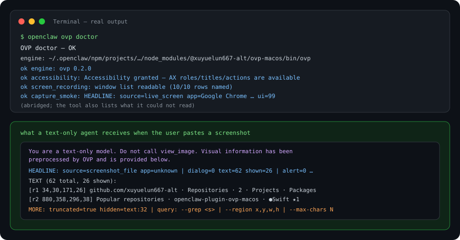
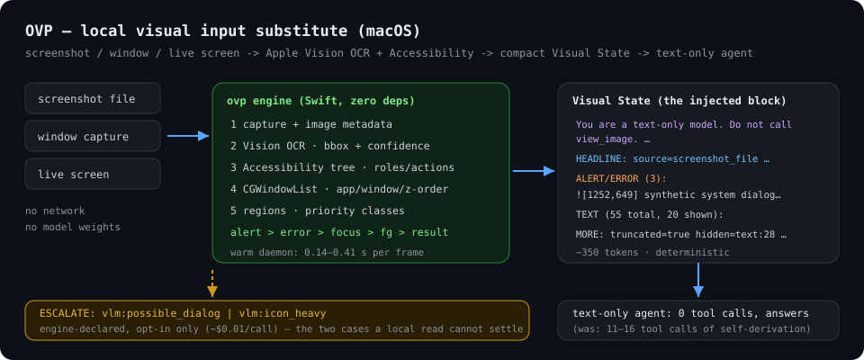

# OVP — give a text-only agent eyes on macOS

[](https://github.com/xuyuelun667-alt/openclaw-plugin-ovp-macos/actions/workflows/ci.yml)


**Your agent can't see. Paste a screenshot and it fails, then burns a dozen tool calls trying to OCR it itself. OVP replaces that whole detour with ~350 tokens of structured text — computed locally, in under half a second, with coordinates.**

An [OpenClaw](https://github.com/openclaw/openclaw) plugin (macOS) that turns a screenshot, a single
window, or the live screen into a **compact, priority-ranked Visual State** using Apple Vision OCR,
`CGWindowList`, and the Accessibility API — and injects it as the agent's image input.

```bash
openclaw plugins install clawhub:@xuyuelun667-alt/ovp-macos
openclaw ovp setup          # wires it up + checks permissions
```



---

## The problem, measured

A text-only model receiving a screenshot has nothing to work with. Real runs from building this
plugin (same machine, same model, same image):

| | without OVP | with OVP |
|---|---|---|
| Tool calls for one image question | **11–16**, often without converging | **0** |
| Tokens burned per image task | ≈ +16k in / +10.6k out vs. baseline | +≈0.4k in |
| Task cost | ≈ $0.020 | ≈ $0.0027 |
| Time to a useful answer | tens of seconds of self-derivation | **0.14–0.41 s** |
| Where the image went | possibly a third-party vision API | nowhere — it never leaves the machine |

The saving is not a smaller prompt. It is the **11–16 rounds the agent no longer invents.**

## How it works



Capture → metadata → Apple Vision OCR (bbox + confidence) → Accessibility tree → `CGWindowList` →
region segmentation → priority classification → contract renderer. One Swift binary, **no
third-party dependencies, no model weights, no network**.

## What the agent actually receives

Not a description — a contract built for a text-only consumer:

```
You are a text-only model. Do not call view_image. Visual information has been preprocessed by OVP and is provided below.
HEADLINE: source=screenshot_file app=unknown | dialog=0 text=55 shown=23 ui=0 | alert=2 error=1 | truncated=true
ALERT/ERROR (3):
  ![1252,649,333,30] c=0.50 synthetic system dialog for
  ![1449,755,38,34] c=1.00 好
TEXT (55 total, 20 shown):
  [r1/generic_region 316,94,380,30] OpenClaw … · ⑤ … · 127.0.0.1:18789/chat/main/…
MORE: truncated=true hidden=text:28 ui:0 reg:6 dup:0 noise:4 | query: --grep <s> | --region x,y,w,h | --max-chars N | --headline-only
ESCALATE: vlm:possible_dialog | local state is insufficient here; an opt-in vision call can resolve it.
```

Four rules make it work:

1. **The first line removes a guaranteed-failing round.** A text-only model cannot use `view_image`.
   Saying so up front eliminated that wasted call in every measured run.
2. **Priority, not reading order.** `dialog/alert > error > focused element > frontmost-window text >
   result-like > everything else`, with a two-pass classifier so a bare button label (`好`, `OK`)
   only counts as a dialog once dialog/error evidence exists. Alerts are force-included even when the
   budget is exhausted.
3. **Truncation is stated, and the follow-up queries are real.** `truncated`, per-category hidden
   counts, and working `--grep` (returns matches *with their neighbours*), `--region`, `--max-chars`,
   `--headline-only`. Nobody has to guess what was dropped.
4. **Escalation is declared by the engine, not guessed by the model.** Two measured triggers:
   `vlm:possible_dialog` (alert text present but no dialog *structure* — typical for screenshot
   files, which have no Accessibility tree) and `vlm:icon_heavy` (almost no text and almost no
   coverage: the frame is graphics). Both opt-in.

## Compared with a hosted vision model

Same images, same tasks, measured side by side ([MiniMax-VL-01](https://platform.minimax.io)):

| | OVP | hosted VLM |
|---|---|---|
| Cost per screenshot | **$0** | ≈ $0.0105 |
| Latency | **0.14–0.41 s** | 11.8–31.2 s |
| Success rate | **6/6** | 6/8 (dense screenshots timed out; 2/2 retries too) |
| Determinism | same input → same output | two runs differed (similarity 0.564) |
| Field-level accuracy (verifiable set) | 94% / 100% | 88% / 100% |
| Coordinates, Accessibility roles, actions | ✅ | ❌ |
| Works offline | ✅ | ❌ |

Two findings worth the read: the VLM **reconstructed a line that was clipped to a 16-pixel sliver**
(where OVP returned garbage and marked it low-confidence) — it looks like higher accuracy until you
check the pixels. And with an unbounded "list all the text" prompt it **timed out twice** on a dense
screenshot. Use it as an *escalation*, not as the default. That is exactly what `ESCALATE:` is for.

## Install

```bash
# ClawHub (once the release passes review)
openclaw plugins install clawhub:@xuyuelun667-alt/ovp-macos
# npm
openclaw plugins install npm:@xuyuelun667-alt/ovp-macos
```

The package ships a **prebuilt universal engine** (`bin/ovp`, arm64 + x86_64), because
`openclaw plugins install` runs with `--ignore-scripts` and cannot build anything at install time.

<details>
<summary>From source, or to rebuild the engine yourself</summary>

```bash
git clone https://github.com/xuyuelun667-alt/openclaw-plugin-ovp-macos
cd openclaw-plugin-ovp-macos
npm install
npm run build:engine     # universal swift build -> ./bin/ovp (atomic replace)
npm run build            # tsc -> ./dist
npm test                 # 16 unit tests, no network or permissions needed

openclaw plugins install "npm-pack:$(npm pack --silent)" --force --accept-capabilities
```
</details>

## Setup and diagnostics

```bash
openclaw ovp setup              # wire it up (idempotent; --dry-run to preview)
openclaw ovp doctor             # engine + Accessibility / Screen Recording preflight
```

`setup` computes the minimal diff, prints **every write with its reason**, applies it through
`openclaw config set` (so it is validated and audited by the host, exactly as if you typed it), then
re-runs the permission check. On an already wired install it says `already wired — nothing to change`.

<details>
<summary>What it writes (the manual equivalent)</summary>

```bash
openclaw config set agents.defaults.imageModel.primary ovp-macos/ovp-local
openclaw config set tools.media.image.maxChars 1500
openclaw config set tools.media.image.preferredModel ovp-macos
openclaw config set tools.alsoAllow '["visual_inspect"]'
openclaw daemon restart
```
</details>

### Permissions (where macOS plugins usually die silently)

Two grants, given to **the process that runs OpenClaw** (the Gateway/node binary) — child processes
inherit them, so `ovp` never needs its own entry:

| Grant | Needed for | Without it |
|---|---|---|
| **Accessibility** | control roles/titles/actions, focused element | control reads are empty (`ui=0`) |
| **Screen Recording** | window list with names, `screencapture` | unnamed window rows; blank captures |

`openclaw ovp doctor` (or the `visual_inspect` tool with `mode=doctor`) tells you exactly which one is
missing and where to enable it.

### Pitfall: `tools.allow` hides every profile tool — use `tools.alsoAllow`

Plugin tools are **not** part of the `coding` profile, so an installed plugin tool is registered but
invisible to the model. The obvious fix is wrong:

```bash
# ❌ REPLACES the profile's base allowlist — the agent then loses exec/read/web as well
openclaw config set tools.allow '["visual_inspect"]'
# ✅ additive: keeps the profile and adds the plugin tool
openclaw config set tools.alsoAllow '["visual_inspect"]'
```

(`allow` and `alsoAllow` are mutually exclusive in the same scope.) We hit this while building the
plugin: the agent surface collapsed to three tools and the plugin *looked* unregistered.

Verify either way:

```bash
openclaw gateway call tools.effective --params '{"sessionKey":"main","agentId":"main"}' --json | grep -i visual_inspect
openclaw agent --session-key agent:main:ovp-check -m "call visual_inspect with mode=doctor"
```

## Using the tool

| mode | what you get |
|---|---|
| `state` (default) | the full compact Visual State for screen / window / file |
| `headline` | ~400-char triage line — cheap "do I need more?" check |
| `grep` | substring search over the cached state, **plus the match's neighbours** (a label alone is rarely the answer) |
| `region` | the contents of one `x,y,w,h` rectangle |
| `json` | raw Visual State: bboxes, classes, timings, cache state |
| `doctor` | engine + permission preflight |

## What it reads — and what it does not

**Reads:** OCR text with pixel bboxes and confidence (CJK confidence runs 0.30–0.50 — low, and *not* a
failure signal); Accessibility roles, titles, values and actions (exact on native and Chromium apps);
window ids, owners, titles, z-order and the frontmost app; heuristic layout regions, marked as
heuristic and never labelled with semantics.

**Does not:**

- **macOS only.** Apple Vision, `CGWindowList` and the Accessibility API are the value; there is no
  portable equivalent worth faking.
- **No photo / chart / diagram semantics** — that needs a vision model, which is what `ESCALATE` is for.
- **No object or icon detection.** Icon-only toolbars stay unreadable; use tooltips or templates.
- **Structured dialog detection in screenshots is unsolved**, and documented as such:
  `VNDetectRectanglesRequest` saturates with small text-line rectangles and never surfaces a modal box,
  and the "dimmed backdrop + bright panel" heuristic fails because **macOS alerts do not dim the
  background** (measured border-ring median luminance 240). Keyword classification plus the escalation
  flag is the honest answer today.
- **Live-screen caching is imperfect**: the menu-bar clock changes pixels, so repeated screen reads
  miss the pixel-hash cache. Image files hit it reliably (108 ms → 4 ms internally).
- **Electron apps**: some report invalid Accessibility geometry; those rects are dropped and the state
  says `ax_unreliable=true` instead of reporting wrong coordinates.

## Privacy

Everything above runs locally. The plugin never calls a network API. Escalation is opt-in: the state
*flags* that a vision model would help, and you (or the agent) decide whether to send the image
anywhere.

## Architecture

```
openclaw-plugin-ovp-macos
├── src/                     plugin (TypeScript)
│   ├── index.ts             media-understanding provider + visual_inspect tool + `openclaw ovp` CLI
│   ├── engine.ts            binary resolution, argument building, output parsing
│   ├── doctor.ts            permission preflight (Accessibility / Screen Recording)
│   └── setup.ts             idempotent config wiring for `openclaw ovp setup`
├── Sources/ovp/             the engine (Swift, no third-party dependencies)
│   ├── Capture.swift        screen / window / file capture + image metadata
│   ├── OCR.swift            Apple Vision text recognition
│   ├── WindowsAX.swift      CGWindowList + Accessibility tree (+ bbox sanitisation)
│   ├── Regions.swift        contrast/whitespace region segmentation
│   ├── Priority.swift       text classification for the cost-aware renderer
│   ├── Render.swift         the contract renderer (priority + truncation + queries)
│   ├── Pipeline.swift       orchestration, coverage/confidence, escalation decision
│   ├── Cache.swift          two-level cache (raw-pixel hash, state hash)
│   └── Daemon.swift         unix-socket resident process (keeps the Vision model warm)
└── scripts/                 build-engine.sh, doctor.sh
```

The engine is also a plain CLI (`ovp inspect …`, `ovp windows`, `ovp ax-check`), usable without the
plugin. Two operational notes worth knowing:

- **A resident daemon keeps the OCR model warm** (first call after boot ≈0.7 s, warm calls
  0.14–0.41 s). A rebuilt engine only takes effect after it restarts — `scripts/build-engine.sh` does
  that for you.
- **Never overwrite a signed Mach-O in place.** Writing `bin/ovp` in place can leave the kernel's
  code-signature cache stale and the next exec dies with `SIGKILL` (137 — reproduced while building
  this). The build script writes to a temp name and `mv`s it into place.

## Development

```bash
npm run build:engine     # engine (universal, atomic replace, restarts a warm daemon)
npm run build            # plugin
npm test                 # 16 unit tests
openclaw ovp doctor      # permissions
```

CI runs the unit tests **and** builds the engine, renders a fixture image with Pillow, runs the real
OCR path against it, and asserts the contract lines survive a 240-character budget. No screenshot is
ever committed: fixtures are generated at run time.

## License

MIT. Issues and macOS-specific war stories welcome.
